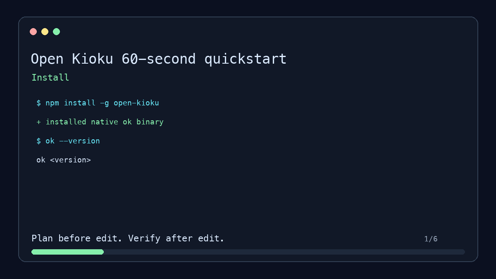

# Open Kioku (`ok`)

[](https://github.com/shivyadavus/open-kioku/actions/workflows/ci.yml)
[](LICENSE)
[](https://www.npmjs.com/package/open-kioku)
[](https://www.rust-lang.org)

Open Kioku is local code intelligence for AI coding agents. It indexes a repository on your machine and gives Claude, Cursor, Codex, and other MCP clients the facts they need before editing: code search, symbols, impact, validation commands, context packs, repo memory, and static/runtime graph evidence.

No hosted index. No source upload. No embeddings API required.

The default path is offline and lexical. SCIP exact references, semantic search, git-history co-change evidence, and runtime evidence are optional local upgrades.



## Copy-Paste 60-Second Quickstart

```sh
npm install -g open-kioku
ok demo --force
ok --repo ./open-kioku-demo plan token --format markdown --limit 6
ok --repo ./open-kioku-demo --json plan token > /tmp/open-kioku-plan.json
ok --repo ./open-kioku-demo --json verify --plan /tmp/open-kioku-plan.json --changed src/auth.rs
```

This creates a local demo repo, indexes it, asks for an evidence-backed plan,
and verifies a bounded edit against that saved plan. The recording is
reproducible with `scripts/quickstart-demo.sh`; regenerate the GIF with
`scripts/render-quickstart-demo.py assets/open-kioku-quickstart.gif`.

## The 60-Second Pitch

Ask an agent to change code in a large repo and it usually starts by crawling files. Open Kioku gives it a better first move:

```text
search_code -> get_definition -> impact_analysis -> find_tests_for_change -> plan_change
```

The output is an evidence-backed pre-edit plan: primary files, relevant symbols, likely blast radius, exact validation commands, confidence, and the next MCP calls to make.

Tested across several large public repositories under permissive open-source
licenses. These metrics are from one representative Open Kioku 2.0.1 run:

```text
4,623 files
46,738 symbols
49,459 chunks
8,945 indexed tests
79,426 graph edges
33.1 seconds to index
```

For a concrete prefix-cache task, Open Kioku found the implementation, related
entry points, and focused tests including:

```text
core/cache_manager.py:491-505
tests/core/test_reset_cache_e2e.py:14-69
tests/core/test_prefix_caching.py:1923-1960
```

The same audit records Python, TypeScript, and C++ coverage, including current
language and exact-reference limitations. Proof:
[`docs/large-repo-proof.md`](docs/large-repo-proof.md),
[`docs/proof.md`](docs/proof.md), and
[`docs/usefulness-proof.md`](docs/usefulness-proof.md).

Hosted demo: https://www.openkioku.com/
Stable CLI + MCP contracts documented in [`STABILITY.md`](STABILITY.md).

### Example Pre-Edit Plan Output

Here is what an evidence-backed plan produced by `ok plan` looks like:

```markdown
# Plan: token

Found 5 primary context item(s), 3 direct impact candidate(s), 2 validation candidate(s)

## Risk
- Level: `low`
- Score: `0.10`

## Confidence
- Overall: `High` (`0.81`)
- Caveats:
  - exact symbol/reference evidence is absent
  - runtime corroboration is absent

## Primary Context
- `src/auth.rs`:7-11: pub fn validate_token(token: &str) -> bool
- `tests/auth_flow.rs`:4-7: fn login_returns_valid_token()
- `src/auth.rs`:3-6: pub fn issue_token(context: &RequestContext, ttl_seconds: u64) -> String

## Impact Candidates
- `src/session.rs` — caller dependency of validate_token
- `src/middleware.rs` — route guard dependency of issue_token

## Validation Targets
- `cargo test auth_flow`
- `cargo test token_expiration`

## Boundary Policy
- Allowed: `src/auth.rs`, `tests/auth_flow.rs`
- Caution: `src/session.rs` (caller)
- Forbidden: `generated/`, `vendor/`
```

## Why It Exists

AI coding agents are strongest when they can ask the codebase for facts before editing. Without indexed context, they burn tokens on repeated file crawling, infer references from text matches, and often pick tests only after a change has already gone wrong.

Open Kioku gives agents a pre-edit routine:

1. Search indexed code and files.
2. Resolve symbols and references.
3. Build an evidence-backed pre-edit plan with likely impact and validation targets.
4. Recall prior repo facts without letting memory outrank indexed code evidence.
5. Compress context into handles that can retrieve the original snippets later.
6. Serve those capabilities through MCP over local stdio.

## Install

### npm

```sh
npm install -g open-kioku
ok --version
```

The `open-kioku` npm package is a JavaScript wrapper that installs the native `ok` binary through platform-specific optional dependencies.

Published platform packages:

- `@open-kioku/darwin-x64`
- `@open-kioku/darwin-arm64`
- `@open-kioku/linux-x64`
- `@open-kioku/linux-arm64`
- `@open-kioku/win32-x64`

### Homebrew

```sh
brew install shivyadavus/open-kioku/open-kioku
ok --version
```

The Homebrew formula installs the native release binary for macOS or Linux from GitHub Releases.

### cargo-binstall

```sh
cargo binstall open-kioku-cli
ok --version
```

`open-kioku-cli` includes cargo-binstall metadata for the same native release binaries. If a binary is unavailable for your platform, use the source install path below.

### crates.io

```sh
cargo install open-kioku-cli
ok --version
```

This compiles the CLI from crates.io. Use this path when you already have Rust installed or when native release binaries are not available for your platform.

### GitHub Releases

Tagged releases publish native binaries and SHA-256 checksums for:

- Linux x86_64 musl
- Linux arm64 musl
- macOS x86_64
- macOS arm64
- Windows x86_64

Download from https://github.com/shivyadavus/open-kioku/releases, put `ok` on your `PATH`, then run:

```sh
ok --help
```

### From Source

```sh
git clone https://github.com/shivyadavus/open-kioku.git
cd open-kioku
cargo install --path crates/open-kioku-cli
ok --help
```

Requires a stable Rust toolchain.

## Quick Start

Use this path for a real repository:

```sh
npm install -g open-kioku
ok init /absolute/path/to/repo
ok index /absolute/path/to/repo
ok doctor /absolute/path/to/repo
ok status /absolute/path/to/repo --markdown --write ok-status.md
ok setup audit /absolute/path/to/repo
ok --repo /absolute/path/to/repo search "the feature or bug you care about" --limit 5
ok mcp install cursor --repo /absolute/path/to/repo
ok mcp install claude --repo /absolute/path/to/repo
ok mcp install codex --repo /absolute/path/to/repo
ok mcp install windsurf --repo /absolute/path/to/repo
ok mcp install trae --repo /absolute/path/to/repo
ok mcp install gemini --repo /absolute/path/to/repo
ok mcp install opencode --repo /absolute/path/to/repo
ok mcp install zed --repo /absolute/path/to/repo
```

`ok index` writes local data under `.ok/`: SQLite metadata and graph rows in `.ok/index.sqlite`, plus BM25 search data in `.ok/search/tantivy`. Repo memory is append-only under `.ok/memory.sqlite`; compressed context originals are retrievable from `.ok/context.sqlite`. Large indexes report progress phases such as `scan`, `parse`, `occurrences`, `store`, `graph`, `search`, and `complete`.

Paste the printed MCP config snippet into Cursor, Claude Code, Codex, Windsurf, Trae, Gemini CLI, OpenCode, Zed, or another MCP-compatible agent. The default server is read-only and runs locally over stdio.

### Git-Based Plugin & Marketplace Distribution

Open Kioku bundles pre-configured repository-scoped plugin and marketplace manifests. This allows teams to share and auto-load the server configurations directly from the repository using agent-specific plugin models:

- **OpenAI Codex**: Install the repository-scoped plugin marketplace directly from GitHub:
  ```sh
  codex plugin marketplace add shivyadavus/open-kioku
  ```
- **Claude Code**: Integrates using the `.claude-plugin/` manifest.
- **Cursor**: Integrates using the `.cursor-plugin/` ruleset.

Starter examples with golden prompts and one-command smoke tests are available
in [`examples/cursor`](examples/cursor) and [`examples/claude`](examples/claude).

`ok status --markdown --write ok-status.md` creates a portable handoff with index counts, SCIP quality, readiness checks, and next steps. `ok setup audit` checks the index, security posture, MCP server health, plugin metadata, and the supported client install matrix.

Ask your agent to use Open Kioku before editing:

```text
Use Open Kioku before editing. Check repo_status, search_code, get_definition,
get_references, impact_analysis, and find_tests_for_change. Build a plan first,
then edit only after the indexed evidence is clear.
```

Keep the index fresh while editing:

```sh
ok watch /absolute/path/to/repo
```

## Quality Mode

Open Kioku works without external language indexers, but exact references improve search grounding, impact analysis, test selection, and planning. Check what is available:

```sh
ok setup audit /absolute/path/to/repo --markdown --write ok-setup.md
ok scip doctor /absolute/path/to/repo
ok scip setup /absolute/path/to/repo
ok index /absolute/path/to/repo --with-scip auto
ok doctor /absolute/path/to/repo
```

Default indexing consumes existing SCIP files such as `index.scip` and `.ok/indexes/*.scip` when present. `--with-scip auto` runs installed indexers for supported repos; it does not install third-party tools. `--with-scip required` fails the index if no SCIP facts can be imported.

SCIP is the primary precision provider. The default quality model stays local and free: indexed symbols/chunks/imports, language-specific static facts, indexed tests, build-system detection, and SCIP exact references when an `index.scip` is available. Java/Gradle repositories get scoped validation commands when the test file path is known, for example `./gradlew :x-pack:plugin:ml:test --tests org.example.SomeTests` instead of a generic repository-wide test command.

Language-specific static analysis adds durable graph facts such as imports, Java inheritance and implemented interfaces, Spring/Express/FastAPI/Rust route declarations, config reads, and database table mappings. Git-history analysis is local and enabled by default: `ok index` and `ok watch` read a bounded local history window, store typed commit metadata and complete per-file touches (including detected renames), and preserve co-change and path-to-test co-run facts for planning, ranking, impact, and test selection. Configure the window with `[history] max_commits = 500`, or disable it with `[history] enabled = false` in `ok.toml`. Runtime analysis is opt-in evidence ingestion only: place local JSONL trace, span, log, incident, error, or failure artifacts under `.ok/runtime/` or `.ok/analysis/runtime/` with source file paths plus routes, methods, SQL statements, or messages, then re-run `ok index`. Open Kioku turns matching entries into runtime signals for context, ranking, impact, test selection, and post-edit verification. It does not install or run a runtime agent by default.

`ok setup audit` keeps CodeQL, BSP, LSP, coverage, and JUnit artifacts in an optional advanced section only when those artifacts are actually present.

Use `ok eval` to protect quality on real workflows:

```sh
ok eval /absolute/path/to/repo \
  --case "fix token expiration=src/auth.rs,tests/auth_flow.rs" \
  --min-recall-at-k 0.8 \
  --min-mrr 0.5
```

Use `ok workflow-bench` for plan -> edit -> verify benchmark cases:

```sh
ok workflow-bench . --cases-file benchmarks/workflow-cases.json --limit 10
```

See [`docs/workflow-benchmarks.md`](docs/workflow-benchmarks.md) for the case
format and rollup metrics.

## Try The Demo

```sh
ok demo --force
ok --repo ./open-kioku-demo search token --limit 5
ok --repo ./open-kioku-demo plan token --format markdown
ok --repo ./open-kioku-demo plan token --format toon
ok --repo ./open-kioku-demo memory remember "auth flow maps issue_token to tests/auth_flow.rs" --source demo
ok --repo ./open-kioku-demo --json context token --compressed
ok --repo ./open-kioku-demo context token --compressed --format toon
ok prove ./open-kioku-demo --task token
ok status ./open-kioku-demo --markdown --write ok-status.md
ok setup audit ./open-kioku-demo --markdown
ok mcp install cursor --repo ./open-kioku-demo
ok mcp install claude --repo ./open-kioku-demo
ok mcp install codex --repo ./open-kioku-demo
ok mcp install windsurf --repo ./open-kioku-demo
ok mcp install trae --repo ./open-kioku-demo
```

`ok demo` creates `./open-kioku-demo`, writes `ok.toml`, and builds the local SQLite and Tantivy indexes. Use `ok demo --path /tmp/open-kioku-demo --force` for a custom path.

## Useful Commands

```sh
ok --repo /path/to/repo search "token expiration handler"
ok --repo /path/to/repo symbol definition PolicyGate
ok --repo /path/to/repo symbol refs PolicyGate
ok --repo /path/to/repo history provenance --path crates/open-kioku-core/src/lib.rs
ok --repo /path/to/repo history provenance --symbol PolicyGate
ok --repo /path/to/repo impact --file crates/open-kioku-mcp/src/lib.rs
ok --repo /path/to/repo tests --changed crates/open-kioku-core/src/lib.rs
ok --repo /path/to/repo context "update MCP docs" --format markdown
ok --repo /path/to/repo --json context "update MCP docs" --compressed
ok --repo /path/to/repo context "update MCP docs" --compressed --format toon
ok --repo /path/to/repo memory remember "release workflow uses scripts/publish-crates.sh" --source human
ok --repo /path/to/repo memory search "release workflow"
ok --repo /path/to/repo plan "update MCP docs" --format markdown
ok --repo /path/to/repo plan "update MCP docs" --format toon
ok status /path/to/repo --markdown --write ok-status.md
ok setup audit /path/to/repo --markdown --write ok-setup.md
ok eval /path/to/repo --case "auth flow=src/auth.rs,tests/auth_flow.rs"
ok prove /path/to/repo --task "auth flow" --task "release workflow"
ok bench /path/to/repo
```

## Share Your Results

Open Kioku outputs are designed to be attached to issues, PRs, and social posts:

```sh
ok --repo /path/to/repo plan "your task" --format markdown > plan.md
ok status /path/to/repo --markdown --write ok-status.md
ok prove /path/to/repo --task "your task"
```

These reports include indexed counts, evidence scores, validation commands, and
path shapes — but intentionally omit source code, so they are safe to share
from private repos.

Current top-level commands: `init`, `index`, `watch`, `status`, `doctor`, `demo`, `setup`, `search`, `symbol`, `explain`, `impact`, `path`, `tests`, `context`, `retrieve-context`, `plan`, `bench`, `workflow-bench`, `prove`, `architecture`, `history`, `patch`, `memory`, `mcp`, and `scip`.

History provenance: [`docs/storage-model.md#provenance-lookup`](docs/storage-model.md#provenance-lookup). Full MCP tool notes: [`docs/mcp-tools.md`](docs/mcp-tools.md). Ranking defaults: [`docs/ranking.md`](docs/ranking.md). Verified command output: [`docs/proof.md`](docs/proof.md). Local usefulness proof: [`docs/usefulness-proof.md`](docs/usefulness-proof.md).

Operator guides: [`docs/guides/agent-workflows.md`](docs/guides/agent-workflows.md), [`docs/guides/cross-harness-setup.md`](docs/guides/cross-harness-setup.md), [`docs/guides/security-threat-model.md`](docs/guides/security-threat-model.md), and [`docs/guides/compressed-context-and-toon.md`](docs/guides/compressed-context-and-toon.md).

## What Is Local

Open Kioku's default path is local:

- Tree-sitter extracts symbols and chunks from supported source files.
- Built-in static analyzers add language/framework graph facts from source text.
- Runtime trace/span/log/incident artifacts are consumed only when local files are provided under `.ok/runtime/` or `.ok/analysis/runtime/`.
- SQLite stores metadata and dependency graph rows under `.ok/`.
- Tantivy stores BM25 lexical search data under `.ok/search/tantivy`.
- Repo memory facts are append-only and local under `.ok/memory.sqlite`.
- Reversible compressed context handles store originals locally under `.ok/context.sqlite`.
- TOON is an optional prompt-rendering format for compact LLM handoff; JSON remains the internal and MCP structured data format.
- MCP uses stdio to talk to the local `ok` process.
- Semantic search is not required for the default workflow.

The MCP server is designed to be source-tree read-only unless write mode is explicitly enabled. Memory and compressed-context tools may write local `.ok/` artifacts so their results can be recalled or expanded later.

## Language Support

Tree-sitter parsing currently covers Rust, Python, TypeScript, TSX, JavaScript, Go, and Java. Files in other languages can still be indexed as files/chunks where supported by the ingest pipeline, but symbol quality depends on available grammar support.

## Security Model

- Read-only by default.
- No hosted index or cloud search service.
- No embeddings API required for default search, symbol, impact, and context workflows.
- Optional semantic search can run with the built-in local provider and no network calls.
- Secret-like paths such as `.env`, `.aws/`, and `.ssh/` are blocked by policy.
- Command execution and patch application are policy-gated.
- Network denial is part of the MCP security config.

See [`docs/security-model.md`](docs/security-model.md) for more detail.

Operational security notes: [`SECURITY.md`](SECURITY.md). Agent-specific threat posture: [`docs/guides/security-threat-model.md`](docs/guides/security-threat-model.md).

## Repository Layout

This is a 44-crate Cargo workspace. Important crates:

- `open-kioku-contract`: versioned change-contract schema and validation.
- `open-kioku-cli`: the `ok` binary.
- `open-kioku-mcp`: JSON-RPC MCP server over stdio.
- `open-kioku-ingest`: repository indexing pipeline.
- `open-kioku-tree-sitter`: syntax parsing and symbol extraction.
- `open-kioku-storage-sqlite`: SQLite metadata, graph, and typed history storage.
- `open-kioku-search-tantivy`: disk-backed BM25 search.
- `open-kioku-vector`: local vector index contracts and exact-flat backend.
- `open-kioku-semantic`: local semantic indexing and hybrid search orchestration.
- `open-kioku-context`: task context pack builder.
- `open-kioku-context-compress`: reversible context handle compression.
- `open-kioku-format`: prompt-oriented renderers, including TOON.
- `open-kioku-memory`: append-only repo memory and entity-linked recall.
- `open-kioku-impact`: file impact analysis.
- `open-kioku-tests`: validation target selection.

Architecture docs: [`docs/architecture.md`](docs/architecture.md) and
[`docs/architecture-policy.md`](docs/architecture-policy.md)

Crate map: [`docs/crate-map.md`](docs/crate-map.md)

Storage model: [`docs/storage-model.md`](docs/storage-model.md)

Semantic search docs: [`docs/semantic-search.md`](docs/semantic-search.md), [`docs/vector-index.md`](docs/vector-index.md), [`docs/embedding-providers.md`](docs/embedding-providers.md), [`docs/hybrid-ranking.md`](docs/hybrid-ranking.md)

Contributor guide: [`docs/contributor-guide.md`](docs/contributor-guide.md)

Roadmap: [`docs/roadmap.md`](docs/roadmap.md)

## License

Open Kioku is licensed under the [Elastic License 2.0](LICENSE), a
source-available license with hosted-service, license-key, and notice
limitations. Review the license text and the
[`docs/license-faq.md`](docs/license-faq.md) summary for details.

## Development

```sh
cargo fmt --all --check
cargo clippy --all-targets --all-features -- -D warnings
cargo test --all
cargo test -p open-kioku-cli --test cli_smoke
```

CI also runs audit and dependency policy checks.

## Contributing

Issues and PRs are welcome, especially for parser quality, fixture coverage, MCP tool quality, and distribution improvements.

See [`CONTRIBUTING.md`](CONTRIBUTING.md).
