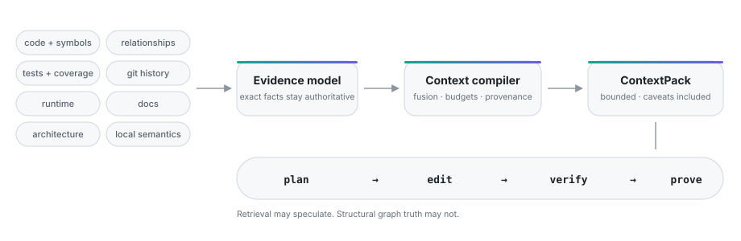

<div align="center">


# Open Kioku

**Evidence before edits.**

A local repository-intelligence and change-safety layer for AI coding agents.

[](https://github.com/shivyadavus/open-kioku/actions/workflows/ci.yml)
[](https://www.npmjs.com/package/open-kioku)
[](https://www.npmjs.com/package/open-kioku)
[](https://crates.io/crates/open-kioku-cli)
[](LICENSE)

[Website](https://www.openkioku.com) · [Quickstart](#first-win-2-commands) · [MCP tools](docs/mcp-tools.md) · [Measured proof](#measured-proof) · [Architecture](docs/architecture.md)

</div>

---

Coding agents guess. They crawl files, grep for names, and hope the right context lands in the window.

Open Kioku replaces that guesswork with evidence. It builds a local model of your repository — symbols, relationships, tests, history, runtime signals, docs, architecture — compiles the smallest useful context for each task, produces a **bounded plan before edits begin**, and **verifies the finished change** against what the agent said it would touch.

<picture>
  <source media="(prefers-color-scheme: dark)" srcset="assets/flow-dark.svg">
  
</picture>

No hosted code index. No source upload. Read-only MCP tools by default. Optional semantic retrieval runs entirely on your machine.

## First Win: 2 Commands

```sh
npm install -g open-kioku
ok setup agent cursor --repo . --apply
```

For Claude Code:

```sh
ok setup agent claude --repo . --apply
```

One command indexes the repository, installs repository-scoped MCP configuration and guidance, and checks that the local server responds (run without `--apply` to preview). From then on, your agent starts every task from a pre-edit evidence routine instead of rediscovering the repository from scratch.

## Why Open Kioku

- **Facts outrank guesses.** Exact definitions, references, and dependency paths stay authoritative; heuristic matches can help retrieval but never overwrite repository truth.
- **Uncertainty stays visible.** Missing evidence lowers confidence and is reported as a caveat. Passing tests don't manufacture certainty the evidence doesn't support. Calibrated abstention is built and gated on held-out performance but is not yet enabled by default — on the frozen corpus, a task with no correct answer still returns results 80% of the time, and that number is published in [`benchmarks/retrieval-baseline.json`](benchmarks/retrieval-baseline.json).
- **The loop closes.** Plans define edit boundaries; verification compares the actual changed files against them. A green exit code is not proof the right files changed.
- **Local by design.** Everything lives under the repository's `.ok/` directory. Network denial is supported and fails closed.

## What Open Kioku Understands

| Evidence | What it contributes |
|---|---|
| **Code & symbols** | Definitions, chunks, imports, occurrences, scopes, source ranges |
| **Relationships & impact** | Dependency paths, calls, references, types, inheritance, affected files/symbols |
| **Tests & coverage** | Validation candidates, test-to-code evidence, local coverage reports |
| **Git history** | Churn, co-change, ownership, reviewers, provenance, similar changes |
| **Runtime evidence** | Local traces, spans, logs, incidents, errors, failures |
| **Documentation** | Heading-aware repository documentation retrieval |
| **Architecture & contracts** | Boundaries, policies, public API/dependency constraints, change contracts |
| **Local semantics** | Optional local embeddings, hybrid retrieval, exact-flat and persistent ANN backends |

Each task is routed through these streams as independent candidates, fused with authority awareness, and compiled into a bounded `ContextPack` with provenance, omissions, and quality signals. Retrieval quality is benchmarked against a frozen corpus with a held-out split and CI-enforced thresholds; the current gated benchmark measures the lexical retrieval path, and extending it to the full routed path is tracked in [#204](https://github.com/shivyadavus/open-kioku/issues/204).

## What Your Agent Gets

```sh
ok plan "change token expiration"
```

…or the `plan_change` MCP tool. A plan includes primary context with evidence provenance, impact candidates, likely validation targets, edit boundaries, explicit missing-evidence caveats, and confidence signals.

After the edit, `ok verify` checks the actual change against the plan — not just whether a command exited 0.

## Measured Proof

Performance claims here are observations tied to an identifiable build, published with method and caveats. The current record validates the `3.1.0` release lineage at source commit `3959fdfb6ca27d0c279b635fca7fc1b7935d4889`, on the same host and protocol as the previous public record — directly comparable, with older records preserved as versioned history.

### Large Java repository (v3.1.0 lineage, end to end)

| Measurement | Result |
|---|---:|
| Tracked source files / Java files | 16,537 / 12,580 |
| Indexed files / symbols / chunks | 13,607 / 247,499 / 248,107 |
| Graph nodes / edges | 402,844 / 1,522,135 |
| Tests / imports | 84,504 / 181,966 |
| Cold structural index | 19m 28s |
| Exact class lookup, fresh process | 0.02–0.05s |
| Exact references / lexical search, fresh process | 0.74s / 0.24s |
| Exact-flat semantic build | 495,606 vectors in 58.8s; 0 failures |
| Persistent HNSW build | 495,606 vectors in 10m 19s; 0 failures |

Against the prior build on the identical corpus and host: fixed per-command startup ~14s → sub-second, exact class lookup 13.9s (returning an incorrect `symbol not found`) → 0.02s with the correct class, lexical search 13.7s → 0.24s, cold structural index 40m 40s → 19m 28s.

The repeat index reproduced identical totals, four parallel graph reads completed without lock failures, and both semantic builds finished with zero failed vectors. The repository identity is intentionally withheld, so this is a scale record rather than a replayable corpus — everything else is auditable in the [machine-readable evidence](demo/proof/large-java-2026-08-31-main.json) and [methodology](docs/large-java-validation-2026-08-31.md). Previous record: [v3.0.4 evidence](demo/proof/large-java-3.0.4.json) · [methodology](docs/large-java-validation-3.0.4.md).

### More proof artifacts

- **Local semantic scale** — 51,349 vectors, persistent HNSW auto-selected above the crossover, 21.70s fresh build, 0 stale / 0 failed vectors: [`demo/proof/ann-50k-dogfood.json`](demo/proof/ann-50k-dogfood.json)
- **Plan → edit → validate → verify** — `cargo test` through the policy-gated validation runner: 2 passed, 0 boundary violations, final verdict `warn` because stronger supporting evidence was absent. That's intentional: [`demo/proof/verification-dogfood.json`](demo/proof/verification-dogfood.json)
- **Public repository audit** — 4,600+ files, 46,000+ symbols, 8,900+ tests indexed locally in 33.1s: [`docs/large-repo-proof.md`](docs/large-repo-proof.md)

These are local workstation timings, not universal guarantees.

## Install

| Method | Command |
|---|---|
| **npm** (recommended) | `npm install -g open-kioku` |
| cargo-binstall | `cargo binstall open-kioku-cli` |
| crates.io | `cargo install open-kioku-cli` |
| From source | `git clone https://github.com/shivyadavus/open-kioku.git && cargo install --path open-kioku/crates/open-kioku-cli` |

## Set Up a Repository

```sh
ok init /absolute/path/to/repo
ok index /absolute/path/to/repo
ok doctor /absolute/path/to/repo
ok status /absolute/path/to/repo --markdown --write ok-status.md
```

Repository intelligence lives under `.ok/` — SQLite metadata/graph state and Tantivy lexical search data. Indexing never rewrites source files. Keep the index current with `ok watch /absolute/path/to/repo`.

## Connect an Agent

```sh
ok setup agent claude --repo /absolute/path/to/repo --apply
ok setup agent cursor --repo /absolute/path/to/repo --apply
```

Manual MCP configuration covers the full client matrix — Cursor, Claude Code, Codex, Gemini CLI, Windsurf, Trae, OpenCode, and Zed:

```sh
ok mcp install <client> --repo /absolute/path/to/repo
```

The MCP server is local, read-only, and speaks stdio. Its 58 tools ship with task-specific usage guidance, input/output schemas, standard safety annotations, and machine-readable routing categories — and a metadata regression test rejects new tools that omit any of it.

Agent setup guides: [Claude Code](https://www.openkioku.com/claude-code-setup.html) · [Cursor](https://www.openkioku.com/cursor-setup.html) · [Codex](https://www.openkioku.com/codex-setup.html) · [Gemini CLI](https://www.openkioku.com/gemini-cli-setup.html)

## Local Semantic Retrieval

Semantic search is optional — the core workflow requires no embedding service. When enabled, embeddings are built locally, retrieval combines semantic and lexical signals, and the backend switches between an exact-flat correctness oracle and a persistent ANN index based on scale.

```sh
ok --repo . semantic status
ok --repo . semantic index
ok --repo . search "authorization expiry" --hybrid
```

Model acquisition is explicit and policy-controlled; network-denied execution fails closed. See [`docs/semantic-search.md`](docs/semantic-search.md), [`docs/vector-index.md`](docs/vector-index.md), and [`docs/embedding-providers.md`](docs/embedding-providers.md).

## Share Proof, Not Source

```sh
ok prove . --task "the feature you're working on" --html
```

`ok prove` creates a shareable report with indexed counts, task scores, validation signals, and caveats — intentionally omitting source snippets. For pull requests, the opt-in [`open-kioku-action`](https://github.com/shivyadavus/open-kioku-action) attaches a privacy-safe preflight artifact:

```yaml
permissions:
  contents: read

steps:
  - uses: actions/checkout@v7
  - uses: shivyadavus/open-kioku-action@v1
    with:
      task: "change token expiration"
      verify: true
```

See [`docs/github-action.md`](docs/github-action.md).

## Beyond a Single Repository

**Multi-project intelligence** — index projects individually, then link them into a workspace without reparsing source:

```toml
[workspace]
projects = [
  { name = "service-a", repo = "../service-a" },
  { name = "service-b", repo = "../service-b" },
]
```

```sh
ok index --mode cross-project --workspace /absolute/path/to/workspace
ok architecture fleet --workspace /absolute/path/to/workspace
```

**Index snapshots** — export/import known-good indexes for team and CI reuse. Personal memory and compressed-context state are excluded from shared snapshots by default:

```sh
ok --repo . snapshot export --quality best
ok --repo . snapshot import
ok --repo . index --from-snapshot auto
```

**Architecture, contracts, and verification** — detect architecture, evaluate policies, create bounded change contracts, and verify constraints around a change:

```sh
ok --repo . architecture detect
ok --repo . architecture policy check --json
ok --repo . --json contract create "update API boundary"
ok --repo . contract verify --id <contract-id> --changed src/api.rs
ok --repo . verify --plan /tmp/plan.json --git
```

## History, Runtime, and Validation Evidence

Git history is on by default with a bounded window: co-change, churn, ownership, provenance, and similar-change signals. Runtime evidence (local JSONL traces/logs/incidents under `.ok/runtime/`) and validation evidence (JUnit XML, lcov, Cobertura, JaCoCo, coverage.py) are opt-in and mapped back to indexed files, symbols, and plausible tests.

These sources contribute evidence; they never outrank exact source and reference truth.

## Benchmarks

Quality is a measured product surface, not a claim:

```sh
ok retrieval-bench . --cases-file benchmarks/retrieval-cases.json --min-cases 30
ok workflow-bench . --cases-file benchmarks/workflow-cases.json --limit 10
ok eval . --case "auth flow=src/auth.rs,tests/auth_flow.rs"
```

The frozen retrieval corpus and regression policy are documented in [`docs/retrieval-benchmark.md`](docs/retrieval-benchmark.md).

## Security Model

- Read-only MCP by default; no hosted repository index; no source upload
- No hosted embeddings required — optional semantic inference stays local
- Secret-like paths blocked by policy; command execution policy-gated
- Source edits remain in the normal editor/agent harness
- Network denial supported; failures are explicit

See [`docs/security-model.md`](docs/security-model.md) and [`SECURITY.md`](SECURITY.md).

## Language Support

Tree-sitter parsing and symbol extraction cover **Rust, Python, TypeScript/TSX, JavaScript/JSX, Go, and Java**. YAML and JSON are parsed structurally; file/chunk indexing also covers TOML, SQL, Markdown, Terraform, and other repository text. Language-aware resolution adds scope, import, receiver/type, containment, and inheritance semantics where supported.

## Useful Commands

```sh
ok --repo . search "token expiration handler"
ok --repo . symbol definition PolicyGate
ok --repo . symbol refs PolicyGate
ok --repo . impact --file src/auth.rs
ok --repo . tests --changed src/auth.rs
ok --repo . context "change token expiration" --format markdown
ok --repo . plan "change token expiration" --format markdown
ok --repo . verify --plan /tmp/plan.json --git
ok --repo . history similar --task "change token expiration" --path src/auth.rs
ok prove . --task "change token expiration"
```

<details>
<summary>All 38 top-level commands</summary>

Current top-level commands (38): `init`, `index`, `snapshot`, `watch`, `status`, `doctor`, `setup`, `demo`, `search`, `semantic`, `symbol`, `explain`, `impact`, `path`, `tests`, `context`, `retrieve-context`, `plan`, `preflight`, `verify-boundary`, `verify`, `contract`, `bench`, `workflow-bench`, `retrieval-bench`, `relationship-bench`, `contract-bench`, `eval`, `prove`, `adr`, `ui`, `architecture`, `history`, `patch`, `memory`, `mcp`, `scip`, and `graph`.

</details>

Full MCP tool reference: [`docs/mcp-tools.md`](docs/mcp-tools.md)

## Repository Layout

This is a 43-crate Cargo workspace. Important crates include:

| Crate | Role |
|---|---|
| `open-kioku-cli` | `ok` CLI and top-level product surface |
| `open-kioku-mcp` | Local JSON-RPC MCP server |
| `open-kioku-core` | Evidence, graph, report, and relationship-authority contracts |
| `open-kioku-ingest` | Indexing pipeline and evidence ingestion |
| `open-kioku-resolution` | Scope/receiver/type-aware semantic resolution |
| `open-kioku-context` | Routed candidate streams and ContextPack compilation |
| `open-kioku-graph` | Evidence graph and query layer |
| `open-kioku-semantic` | Local semantic indexing and hybrid retrieval |
| `open-kioku-vector` | Exact-flat oracle and persistent local ANN backend |
| `open-kioku-plan` | Evidence-backed pre-edit planning |
| `open-kioku-impact` | Impact analysis |
| `open-kioku-tests` | Validation target selection |
| `open-kioku-architecture` | Architecture detection and policy evaluation |
| `open-kioku-contract` | Change-contract schema and validation |
| `open-kioku-patch` | Post-edit verification |
| `open-kioku-storage-sqlite` | Local persistence |

Architecture: [`docs/architecture.md`](docs/architecture.md) · Crate map: [`docs/crate-map.md`](docs/crate-map.md) · Storage: [`docs/storage-model.md`](docs/storage-model.md)

## Development

```sh
cargo fmt --all --check
cargo clippy --all-targets --all-features -- -D warnings
cargo test --all
cargo test -p open-kioku-cli --test cli_smoke
ok retrieval-bench . --cases-file benchmarks/retrieval-cases.json --min-cases 30
ok workflow-bench . --cases-file benchmarks/workflow-cases.json --limit 10
```

## Contributing

Issues and pull requests are welcome. See [`CONTRIBUTING.md`](CONTRIBUTING.md).

---

<div align="center">

If Open Kioku improves your agent workflow, consider [starring the repository ⭐](https://github.com/shivyadavus/open-kioku)

</div>
