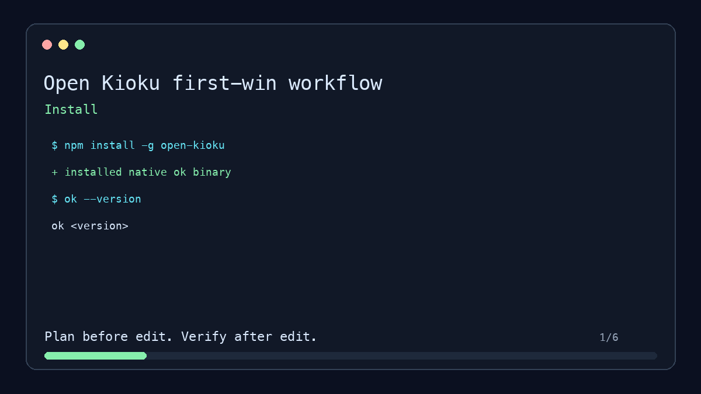

# Open Kioku (`ok`)

[](https://github.com/shivyadavus/open-kioku/actions/workflows/ci.yml)
[](https://www.npmjs.com/package/open-kioku)
[](https://www.npmjs.com/package/open-kioku)
[](LICENSE)

Give Claude, Cursor, Codex, or any MCP-compatible coding agent an **evidence layer** before it edits your codebase, using local indexes and read-only MCP tools by default.



## First Win: 4 Commands

Run these commands on **your own repo**:

```sh
npm install -g open-kioku
ok init .
ok index .
ok mcp install cursor --repo .
```

`ok init` and `ok index` create the local index. `ok mcp install` prints a
repository-scoped, read-only MCP entry; paste that JSON into your Cursor MCP
settings. It does not modify client configuration automatically.

Then ask your agent for the change you need. Start with `plan_change` so it
grounds the work in indexed evidence and reports caveats instead of pretending
uncertain results are facts.

For Claude Code, use:

```sh
ok mcp install claude --repo .
```

Other MCP-compatible clients can use the manual configuration snippets in
[Connect Your Agent](#connect-your-agent).

## See the Proof

Run `ok prove` on your repo to produce a shareable Markdown or HTML report with indexed counts, task scores, and validation signals. The report intentionally omits source snippets, so it is designed to be reviewed and shared from private repos:

```sh
ok prove . --task "the feature you're working on"
ok prove . --task "the feature you're working on" --html
```

A representative public-repo audit indexed 4,600+ files, 46,000+ symbols, and 8,900+ tests locally in 33.1s. The exact Open Kioku version, repository revisions, caveats, and language limitations are recorded in [`docs/large-repo-proof.md`](docs/large-repo-proof.md).

## Pull-request evidence

Use the opt-in [`open-kioku-action`](https://github.com/shivyadavus/open-kioku-action)
to attach a privacy-safe local preflight artifact to a pull-request workflow:

```yaml
permissions:
  contents: read

steps:
  - uses: actions/checkout@v4
  - uses: shivyadavus/open-kioku-action@v1
    with:
      task: "change token expiration"
      verify: true
```

The artifact records the CLI version, commit SHA, local-index hash, preflight
hash, redacted changed-file shapes, decision, validation exit status, and
caveats. It never includes source snippets. Validation execution and PR comments
are explicit opt-ins; see [`docs/github-action.md`](docs/github-action.md).

## What Your Agent Gets

```text
Explore → plan_change → edit → verify_change
```

Start with `ok plan "your task"` or MCP `plan_change` for an evidence-backed
change plan. It returns relevant files, validation candidates, edit boundaries,
evidence references, and index quality.

### What The First Plan Tells You

`ok plan` and MCP `plan_change` turn indexed evidence into a bounded pre-edit
plan. On the bundled demo repo, a `token` task currently surfaces:

- primary context in `src/auth.rs`, `src/lib.rs`, and `tests/auth_flow.rs`
- validation candidates such as `issue_token`, `validate_token`, and `login_returns_valid_token` via `cargo test`
- an edit boundary that allows the relevant source and test files while keeping generated, vendored, build, and `.ok/` artifacts out of scope
- explicit caveats when exact-reference, runtime, history, or coverage evidence is unavailable

## Why It Exists

AI coding agents are strongest when they can ask the codebase for facts before editing. Without indexed context, they burn tokens on repeated file crawling, infer references from text matches, and often pick tests only after a change has already gone wrong.

Open Kioku gives agents a pre-edit routine:

1. Search indexed code and files.
2. Resolve symbols and references.
3. Run a plan to get evidence-backed edit boundaries and validation targets.
4. Recall prior repo facts without letting memory outrank indexed code evidence.
5. Compress context into handles that can retrieve the original snippets later.
6. Serve those capabilities through MCP over local stdio.

## Install

### npm (recommended)

```sh
npm install -g open-kioku
ok --version
```

The `open-kioku` npm package is a JavaScript wrapper that installs the native `ok` binary through platform-specific optional dependencies.

Published platform packages:

- `@open-kioku/darwin-x64`
- `@open-kioku/darwin-arm64`
- `@open-kioku/linux-x64`
- `@open-kioku/linux-arm64`
- `@open-kioku/win32-x64`

### cargo-binstall

```sh
cargo binstall open-kioku-cli
ok --version
```

### crates.io

```sh
cargo install open-kioku-cli
ok --version
```

### GitHub Releases

Tagged releases publish native binaries and SHA-256 checksums for Linux x86_64/arm64 musl, macOS x86_64/arm64, and Windows x86_64. Download from https://github.com/shivyadavus/open-kioku/releases.

### From Source

```sh
git clone https://github.com/shivyadavus/open-kioku.git
cd open-kioku
cargo install --path crates/open-kioku-cli
ok --help
```

Requires a stable Rust toolchain.

## Set Up Your Repo

```sh
ok init /absolute/path/to/repo
ok index /absolute/path/to/repo
ok doctor /absolute/path/to/repo
ok status /absolute/path/to/repo --markdown --write ok-status.md
ok setup audit /absolute/path/to/repo
ok --repo /absolute/path/to/repo search "the feature or bug you care about" --limit 5
```

`ok index` writes local data under `.ok/`: SQLite metadata and graph rows in `.ok/index.sqlite`, plus BM25 search data in `.ok/search/tantivy`. Large indexes report progress phases such as `scan`, `parse`, `occurrences`, `store`, `graph`, `search`, and `complete`.

Keep the index fresh while editing:

```sh
ok watch /absolute/path/to/repo
```

## Connect Your Agent

<<<<<<< HEAD
For a configuration snippet for each supported MCP client, use:
=======
Claude Code and Cursor have safe repository-scoped onboarding:

```sh
ok setup agent claude --repo /absolute/path/to/repo --apply
ok setup agent cursor --repo /absolute/path/to/repo --apply
```

Without `--apply`, these commands are dry runs and make no changes. `--check`
verifies the configuration, index, and local MCP response; `--uninstall` removes
only Open Kioku-managed entries and guidance files while preserving `.ok/` data.

For a manual configuration snippet, or for other supported MCP clients, use:
>>>>>>> c6dfbda (feat: add safe agent onboarding)

```sh
ok mcp install cursor --repo /absolute/path/to/repo
ok mcp install claude --repo /absolute/path/to/repo
ok mcp install codex --repo /absolute/path/to/repo
ok mcp install gemini --repo /absolute/path/to/repo
ok mcp install windsurf --repo /absolute/path/to/repo
ok mcp install trae --repo /absolute/path/to/repo
ok mcp install opencode --repo /absolute/path/to/repo
ok mcp install zed --repo /absolute/path/to/repo
```

Paste the printed MCP config snippet into your agent. The default server is read-only and runs locally over stdio. The install matrix is tested for Claude, Cursor, Codex, Gemini CLI, OpenCode, Zed, Windsurf, and Trae.

Agent-specific setup guides: [Claude](https://www.openkioku.com/claude-code-setup.html) · [Cursor](https://www.openkioku.com/cursor-setup.html) · [Codex](https://www.openkioku.com/codex-setup.html) · [Gemini CLI](https://www.openkioku.com/gemini-cli-setup.html). OpenCode, Zed, Windsurf, and Trae use the same verified `ok mcp install <client> --repo /absolute/path/to/repo` flow shown above.

### Plugin Metadata

Open Kioku bundles pre-configured repository-scoped plugin and marketplace manifests:

- **OpenAI Codex**: verified MCP setup is `ok mcp install codex --repo /absolute/path/to/repo`; `.codex-plugin/` metadata is included for Codex installations that support Git-scoped plugin manifests.
- **Claude**: `.claude-plugin/` metadata is included alongside the verified `ok mcp install claude --repo /absolute/path/to/repo` MCP config path.
- **Cursor**: `.cursor-plugin/` rules and skills are included alongside the verified `ok mcp install cursor --repo /absolute/path/to/repo` MCP config path.

Starter examples with golden prompts and one-command smoke tests are available
in [`examples/cursor`](examples/cursor) and [`examples/claude`](examples/claude).

`ok status --markdown --write ok-status.md` creates a portable handoff with index counts, SCIP quality, readiness checks, and next steps. `ok setup audit` checks the index, security posture, MCP server health, plugin metadata, and the supported client install matrix.

## Multi-Project Workspace

For a fleet or multi-service workspace, index each project first, then create a workspace config:

```toml
[workspace]
projects = [
  { name = "service-a", repo = "../service-a" },
  { name = "service-b", repo = "../service-b" },
]
```

Run the cross-project linker without reparsing source:

```sh
ok index --mode cross-project --workspace /absolute/path/to/workspace
ok architecture fleet --workspace /absolute/path/to/workspace
```

## Index Snapshots

Teams and CI can share a known-good local index without sharing personal memory or compressed context state:

```sh
ok --repo /absolute/path/to/repo snapshot export --quality best
ok --repo /absolute/path/to/repo snapshot doctor
ok --repo /absolute/path/to/repo snapshot import
ok --repo /absolute/path/to/repo index --from-snapshot auto
```

## Quality Mode

Open Kioku works without external language indexers, but exact references improve search grounding, impact analysis, test selection, and planning. Check what is available:

```sh
ok setup audit /absolute/path/to/repo --markdown --write ok-setup.md
ok scip doctor /absolute/path/to/repo
ok scip setup /absolute/path/to/repo
ok index /absolute/path/to/repo --with-scip auto
ok doctor /absolute/path/to/repo
```

Default indexing consumes existing SCIP files such as `index.scip` and `.ok/indexes/*.scip` when present. `--with-scip auto` runs installed indexers for supported repos; it does not install third-party tools. `--with-scip required` fails the index if no SCIP facts can be imported.

For Maven and Gradle projects, follow the [Java SCIP proof path](docs/guides/java-scip.md) to generate `index.scip`, import it with an explicit required check, and confirm the exact-reference count.

SCIP is the primary precision provider. The default quality model stays local and free: indexed symbols/chunks/imports, language-specific static facts, indexed tests, build-system detection, and SCIP exact references when an `index.scip` is available. Java/Gradle repositories get scoped validation commands when the test file path is known, for example `./gradlew :x-pack:plugin:ml:test --tests org.example.SomeTests` instead of a generic repository-wide test command.

Language-specific static analysis adds durable graph facts such as imports, Java inheritance and implemented interfaces, Spring/Express/FastAPI/Rust route declarations, config reads, and database table mappings. Git-history analysis is local and enabled by default: `ok index` and `ok watch` read a bounded local history window, store typed commit metadata and complete per-file touches (including detected renames), and preserve co-change, path-to-test co-run, churn, provenance, ownership, reviewer, and similar-change evidence for planning, ranking, impact, contracts, and test selection. History score components are named `history_churn`, `ownership_risk`, `similar_change_overlap`, and `reviewer_affinity`; exact references and exact symbol/file evidence remain authoritative. Configure the window with `[history] max_commits = 500`, or disable it with `[history] enabled = false` in `ok.toml`.

Runtime analysis is opt-in evidence ingestion only: place local JSONL trace, span, log, incident, error, or failure artifacts under `.ok/runtime/` or `.ok/analysis/runtime/` with source file paths plus fields such as service, symbol/function, route, HTTP method, status code, duration, timestamp, SQL statement, and message, then re-run `ok index`. Open Kioku turns matching entries into runtime signals and aggregates for context, ranking, impact, test selection, and post-edit verification. Runtime evidence is local observation only: it never replaces source, symbol, test, or exact-reference truth.

Validation evidence is also local and opt-in. `ok index` ingests JUnit XML, lcov, Cobertura XML, JaCoCo XML, and coverage.py XML/JSON reports from `.ok/analysis/`, `.ok/coverage/`, `coverage/`, `target/site/`, `build/reports/`, and `reports/`. Covered lines are mapped to indexed files and symbols where possible, linked to plausible indexed tests, and surfaced as `TEST_COVERS` / `VALIDATES` graph facts.

Use `ok eval` to protect quality on real workflows:

```sh
ok eval /absolute/path/to/repo \
  --case "fix token expiration=src/auth.rs,tests/auth_flow.rs" \
  --min-recall-at-k 0.8 \
  --min-mrr 0.5
```

Use `ok workflow-bench` for plan → edit → verify benchmark cases:

```sh
ok workflow-bench . --cases-file benchmarks/workflow-cases.json --limit 10
```

See [`docs/workflow-benchmarks.md`](docs/workflow-benchmarks.md) for the case format and rollup metrics.

## Try The Demo

```sh
ok demo --force
ok --repo ./open-kioku-demo search token --limit 5
ok --repo ./open-kioku-demo plan token --format markdown
ok --repo ./open-kioku-demo plan token --format toon
ok --repo ./open-kioku-demo memory remember "auth flow maps issue_token to tests/auth_flow.rs" --source demo
ok --repo ./open-kioku-demo --json context token --compressed
ok --repo ./open-kioku-demo context token --compressed --format toon
ok prove ./open-kioku-demo --task token
ok status ./open-kioku-demo --markdown --write ok-status.md
ok setup audit ./open-kioku-demo --markdown
ok mcp install cursor --repo ./open-kioku-demo
ok mcp install claude --repo ./open-kioku-demo
```

`ok demo` creates `./open-kioku-demo`, writes `ok.toml`, and builds the local SQLite and Tantivy indexes.

## Share Your Results

Open Kioku outputs are designed to be attached to issues, PRs, and social posts:

```sh
ok --repo /path/to/repo plan "your task" --format markdown > plan.md
ok status /path/to/repo --markdown --write ok-status.md
ok prove /path/to/repo --task "your task"
```

These reports include indexed counts, evidence scores, validation commands, and path shapes, but intentionally omit source snippets so you can review and share them without posting repository contents.

## Useful Commands

```sh
ok --repo /path/to/repo search "token expiration handler"
ok --repo /path/to/repo symbol definition PolicyGate
ok --repo /path/to/repo symbol refs PolicyGate
ok --repo /path/to/repo history provenance --path crates/open-kioku-core/src/lib.rs
ok --repo /path/to/repo history provenance --symbol PolicyGate
ok --repo /path/to/repo history churn --path crates/open-kioku-core/src/lib.rs
ok --repo /path/to/repo history similar --task "fix token expiration" --path src/auth.rs
ok --repo /path/to/repo history ownership --path crates/open-kioku-core/src/lib.rs
ok --repo /path/to/repo history reviewers --path crates/open-kioku-core/src/lib.rs
ok --repo /path/to/repo impact --file crates/open-kioku-mcp/src/lib.rs
ok --repo /path/to/repo tests --changed crates/open-kioku-core/src/lib.rs
ok --repo /path/to/repo context "update MCP docs" --format markdown
ok --repo /path/to/repo --json context "update MCP docs" --compressed
ok --repo /path/to/repo context "update MCP docs" --compressed --format toon
ok --repo /path/to/repo memory remember "release workflow uses scripts/publish-crates.sh" --source human
ok --repo /path/to/repo memory search "release workflow"
ok --repo /path/to/repo plan "update MCP docs" --format markdown
ok --repo /path/to/repo plan "update MCP docs" --format html
ok --repo /path/to/repo plan "update MCP docs" --format toon
ok --repo /path/to/repo --json contract create "update MCP docs" --limit 12
ok --repo /path/to/repo contract show <contract-id> --format markdown
ok --repo /path/to/repo contract export <contract-id> --format toon
ok --repo /path/to/repo --json contract verify --id <contract-id> --changed README.md
ok --repo /path/to/repo adr add "API boundary" --component api --file src/api/mod.rs
ok --repo /path/to/repo adr link <adr-id> --validation-rule "cargo test"
ok --repo /path/to/repo adr explain --task "update API boundary"
ok --repo /path/to/repo ui --task "update API boundary"
ok status /path/to/repo --markdown --write ok-status.md
ok setup audit /path/to/repo --markdown --write ok-setup.md
ok --repo /path/to/repo snapshot export --quality fast
ok --repo /path/to/repo snapshot import
ok eval /path/to/repo --case "auth flow=src/auth.rs,tests/auth_flow.rs"
ok prove /path/to/repo --task "auth flow" --task "release workflow"
ok bench /path/to/repo
ok --repo /path/to/repo verify --plan /tmp/plan.json --changed README.md --format html
ok --repo /path/to/repo architecture detect
ok --repo /path/to/repo architecture overview
ok --repo /path/to/repo architecture hotspots
ok --repo /path/to/repo architecture policy check --json
ok --repo /path/to/repo graph schema
ok --repo /path/to/repo semantic status
ok --repo /path/to/repo explain file src/auth.rs
ok --repo /path/to/repo explain symbol validate_token
```

Current top-level commands (36): `init`, `index`, `snapshot`, `watch`, `status`, `doctor`, `setup`, `demo`, `search`, `semantic`, `symbol`, `explain`, `impact`, `path`, `tests`, `context`, `retrieve-context`, `plan`, `preflight`, `verify-boundary`, `verify`, `contract`, `bench`, `workflow-bench`, `contract-bench`, `eval`, `prove`, `adr`, `ui`, `architecture`, `history`, `patch`, `memory`, `mcp`, `scip`, and `graph`.

History provenance, churn hotspots, similar changes, ownership lookup, and reviewer suggestions: [`docs/storage-model.md`](docs/storage-model.md). Full MCP tool reference (58 tools): [`docs/mcp-tools.md`](docs/mcp-tools.md). Ranking defaults: [`docs/ranking.md`](docs/ranking.md). Verified command output: [`docs/proof.md`](docs/proof.md). Local usefulness proof: [`docs/usefulness-proof.md`](docs/usefulness-proof.md).

Operator guides: [`docs/guides/agent-workflows.md`](docs/guides/agent-workflows.md), [`docs/guides/cross-harness-setup.md`](docs/guides/cross-harness-setup.md), [`docs/guides/security-threat-model.md`](docs/guides/security-threat-model.md), and [`docs/guides/compressed-context-and-toon.md`](docs/guides/compressed-context-and-toon.md).

## What Is Local

Open Kioku's default path is local:

- Tree-sitter extracts symbols and chunks from supported source files.
- Built-in static analyzers add language/framework graph facts from source text.
- Runtime trace/span/log/incident artifacts are consumed only when local files are provided under `.ok/runtime/` or `.ok/analysis/runtime/`.
- SQLite stores metadata and dependency graph rows under `.ok/`.
- Tantivy stores BM25 lexical search data under `.ok/search/tantivy`.
- Index snapshots are local `.ok/artifacts/index.snapshot.*` files for sharing the SQLite index DB; personal memory and compressed context databases are excluded by default.
- Repo memory facts are append-only and local under `.ok/memory.sqlite`.
- Reversible compressed context handles store originals locally under `.ok/context.sqlite`.
- TOON is an optional prompt-rendering format for compact LLM handoff; JSON remains the internal and MCP structured data format.
- MCP uses stdio to talk to the local `ok` process.
- Semantic search is not required for the default workflow.

The MCP server does not edit source files. Memory and compressed-context tools may write local `.ok/` artifacts so their results can be recalled or expanded later; make source edits with the normal editor and verify them with Open Kioku.

## Language Support

Tree-sitter parsing and symbol extraction covers Rust, Python, TypeScript (including TSX), JavaScript (including JSX), Go, and Java. YAML and JSON are parsed for structure. Language detection and file-level indexing extend to TOML, SQL, Markdown, and Terraform. Files in other languages can still be indexed as files and chunks, but symbol quality depends on available grammar support.

## Security Model

- Read-only by default.
- No hosted index or cloud search service.
- No embeddings API required for default search, symbol, impact, and context workflows.
- Optional semantic search can run with the built-in local provider and no network calls.
- Secret-like paths such as `.env`, `.aws/`, and `.ssh/` are blocked by policy.
- Command execution is policy-gated; source edits remain in the normal editor.
- Network denial is part of the MCP security config.

See [`docs/security-model.md`](docs/security-model.md) for more detail.

Operational security notes: [`SECURITY.md`](SECURITY.md). Agent-specific threat posture: [`docs/guides/security-threat-model.md`](docs/guides/security-threat-model.md).

## Repository Layout

This is a 41-crate Cargo workspace. Important crates:

- `open-kioku-cli`: the `ok` binary (33 subcommands).
- `open-kioku-mcp`: JSON-RPC MCP server over stdio (58 tools).
- `open-kioku-core`: shared types, evidence data model, and report schemas.
- `open-kioku-ingest`: repository indexing pipeline with static analysis and runtime evidence ingestion.
- `open-kioku-tree-sitter`: syntax parsing and symbol extraction.
- `open-kioku-git`: local git history analysis, co-change evidence, rename tracking, and ownership resolution.
- `open-kioku-graph`: evidence graph storage, buffered writes, query DSL, and versioned schema.
- `open-kioku-architecture`: architecture detection, boundary analysis, and policy edge evaluation.
- `open-kioku-storage-sqlite`: SQLite metadata, graph, and typed history storage.
- `open-kioku-search-tantivy`: disk-backed BM25 lexical search.
- `open-kioku-vector`: local vector index contracts and exact-flat backend.
- `open-kioku-semantic`: local semantic indexing and hybrid search orchestration.
- `open-kioku-impact`: file and symbol impact analysis.
- `open-kioku-plan`: evidence-backed pre-edit planning engine.
- `open-kioku-tests`: validation target selection and test-to-code mapping.
- `open-kioku-ranking`: multi-signal ranking with configurable weights.
- `open-kioku-evidence`: evidence aggregation and schema framework.
- `open-kioku-context`: task context pack builder.
- `open-kioku-context-compress`: reversible context handle compression.
- `open-kioku-format`: prompt-oriented renderers, including TOON.
- `open-kioku-memory`: append-only repo memory and entity-linked recall.
- `open-kioku-contract`: versioned change-contract schema and validation.
- `open-kioku-actions`: policy-gated action framework for command execution and patching.
- `open-kioku-watch`: file-system watcher for incremental re-indexing.
- `open-kioku-daemon`: background indexing daemon.
- `open-kioku-sandbox`: sandboxed command execution.

Architecture docs: [`docs/architecture.md`](docs/architecture.md) and
[`docs/architecture-policy.md`](docs/architecture-policy.md)

Crate map: [`docs/crate-map.md`](docs/crate-map.md)

Storage model: [`docs/storage-model.md`](docs/storage-model.md)

Semantic search docs: [`docs/semantic-search.md`](docs/semantic-search.md), [`docs/vector-index.md`](docs/vector-index.md), [`docs/embedding-providers.md`](docs/embedding-providers.md), [`docs/hybrid-ranking.md`](docs/hybrid-ranking.md)

Contributor guide: [`docs/contributor-guide.md`](docs/contributor-guide.md)

Roadmap: [`docs/roadmap.md`](docs/roadmap.md)

Hosted demo: https://www.openkioku.com/

Stable CLI + MCP contracts documented in [`STABILITY.md`](STABILITY.md).

## Development

```sh
cargo fmt --all --check
cargo clippy --all-targets --all-features -- -D warnings
cargo test --all
cargo test -p open-kioku-cli --test cli_smoke
ok workflow-bench . --cases-file benchmarks/workflow-cases.json --limit 10
ok --repo . history bench --cases-file benchmarks/history-cases.json
```


CI also runs audit and dependency policy checks.

## Contributing

Issues and PRs are welcome, especially for parser quality, fixture coverage, MCP tool quality, and distribution improvements.

See [`CONTRIBUTING.md`](CONTRIBUTING.md).

---

If Open Kioku helps your agent workflow, consider [starring it on GitHub](https://github.com/shivyadavus/open-kioku).
