# Crate Map

Open Kioku is a Rust workspace with **44 crates**. This document maps every
crate to its architectural layer, describes what it does, and tells you where to
start for common contribution tasks.

> See also: [Architecture overview](architecture.md) · [Contributor guide](contributor-guide.md)

---

## Architecture Diagram

```mermaid
graph TD
    subgraph Interface["Interface Layer"]
        CLI["open-kioku-cli"]
        MCP["open-kioku-mcp"]
        Daemon["open-kioku-daemon"]
    end

    subgraph Agent["Agent Intelligence Layer"]
        Context["open-kioku-context"]
        Ranking["open-kioku-ranking"]
        Impact["open-kioku-impact"]
        Tests["open-kioku-tests"]
        Patch["open-kioku-patch"]
        Plan["open-kioku-plan"]
        Actions["open-kioku-actions"]
        Format["open-kioku-format"]
        Evidence["open-kioku-evidence"]
        Memory["open-kioku-memory"]
        ContextCompress["open-kioku-context-compress"]
    end

    subgraph Kernel["Code Intelligence Kernel"]
        Ingest["open-kioku-ingest"]
        Parse["open-kioku-parse"]
        TreeSitter["open-kioku-tree-sitter"]
        Languages["open-kioku-languages"]
        Symbols["open-kioku-symbols"]
        Graph["open-kioku-graph"]
        Arch["open-kioku-architecture"]
        Git["open-kioku-git"]
        Watch["open-kioku-watch"]
    end

    subgraph Storage["Storage Layer"]
        StorageTrait["open-kioku-storage"]
        SQLite["open-kioku-storage-sqlite"]
        KV["open-kioku-storage-kv"]
        Search["open-kioku-search"]
        SearchRegex["open-kioku-search-regex"]
        SearchTantivy["open-kioku-search-tantivy"]
    end

    subgraph Integrations["Optional Integrations"]
        SCIP["open-kioku-scip"]
        LSP["open-kioku-lsp"]
        Semantic["open-kioku-semantic"]
        Vector["open-kioku-vector"]
        Embeddings["open-kioku-embeddings"]
        Qdrant["open-kioku-qdrant"]
        Sentry["open-kioku-sentry"]
    end

    subgraph Shared["Shared"]
        Contract["open-kioku-contract"]
        Core["open-kioku-core"]
        Config["open-kioku-config"]
        Errors["open-kioku-errors"]
        Sandbox["open-kioku-sandbox"]
    end

    %% Dependency flows
    CLI --> Context
    CLI --> Impact
    CLI --> Plan
    MCP --> Context
    MCP --> Impact
    MCP --> Actions
    Daemon --> Watch
    Daemon --> Ingest

    Context --> Ranking
    Context --> ContextCompress
    Impact --> Graph
    Impact --> Symbols
    Tests --> Graph
    Patch --> Plan
    Plan --> Evidence
    Actions --> Memory
    Actions --> Format

    Ingest --> Parse
    Parse --> TreeSitter
    TreeSitter --> Languages
    Symbols --> Parse
    Graph --> Symbols
    Arch --> Graph
    Git --> Core
    Git --> StorageTrait

    StorageTrait --> Core
    SQLite --> StorageTrait
    KV --> StorageTrait
    Search --> Core
    SearchRegex --> Search
    SearchTantivy --> Search

    Semantic --> Embeddings
    Embeddings --> Vector
    Vector --> Qdrant

    SCIP --> Symbols
    LSP --> Symbols

    %% Shared dependencies (simplified)
    Context --> Core
    Ingest --> Core
    StorageTrait --> Errors
    CLI --> Config
    MCP --> Config
```

---

## Layer Descriptions

### Interface Layer

| Crate | Description |
|---|---|
| `open-kioku-cli` | The `ok` binary. Parses CLI arguments, dispatches to agent-intelligence and kernel crates, and renders terminal output. |
| `open-kioku-mcp` | JSON-RPC MCP server exposing all tools to AI coding agents (Cursor, Claude, Codex, Gemini, OpenCode, Zed). |
| `open-kioku-daemon` | Long-running background process for file watching and incremental re-indexing. |

### Agent Intelligence Layer

| Crate | Description |
|---|---|
| `open-kioku-context` | Builds context packs — ranked, token-budgeted bundles of code for agent consumption. |
| `open-kioku-ranking` | Signal-based ranking engine that scores search results and symbols by relevance. |
| `open-kioku-impact` | Analyzes the blast radius of a code change across the dependency graph. |
| `open-kioku-tests` | Identifies tests affected by a change using graph reachability. |
| `open-kioku-patch` | Generates and validates code patches. |
| `open-kioku-plan` | Multi-step change planning with evidence gathering. |
| `open-kioku-actions` | Orchestrates compound agent actions (search → analyze → plan). |
| `open-kioku-format` | Output formatting for terminal, JSON, and markdown. |
| `open-kioku-evidence` | Collects and scores evidence supporting a planned change. |
| `open-kioku-memory` | Persistent fact storage — `remember_fact` / `recall_facts` for agents. |
| `open-kioku-context-compress` | Compresses context packs for efficient retrieval across conversation turns. |

### Code Intelligence Kernel

| Crate | Description |
|---|---|
| `open-kioku-ingest` | Orchestrates the full indexing pipeline: walk → parse → store. |
| `open-kioku-parse` | Language-aware file parsing that produces symbol and scope information. |
| `open-kioku-tree-sitter` | Tree-sitter grammar integration and AST traversal utilities. |
| `open-kioku-languages` | Language detection, grammar loading, and language-specific query definitions. |
| `open-kioku-symbols` | Symbol table: definitions, references, and occurrence tracking. |
| `open-kioku-graph` | Builds and queries the code dependency / call graph. |
| `open-kioku-architecture` | High-level architectural analysis (module boundaries, layering). |
| `open-kioku-git` | Bounded local Git commit/file-touch ingest, zero-context patch ranges, rename parsing, co-change derivation, and ownership resolution. |
| `open-kioku-watch` | File-system watcher for incremental re-indexing. |

### Storage Layer

| Crate | Description |
|---|---|
| `open-kioku-storage` | Abstract metadata, graph, history, and search storage traits. |
| `open-kioku-storage-sqlite` | SQLite-backed persistent storage, typed history evidence, provenance lookup, and materialized churn/hotspot summaries. |
| `open-kioku-storage-kv` | Lightweight key-value store for caching and ephemeral data. |
| `open-kioku-search` | Abstract search trait for full-text and symbol search. |
| `open-kioku-search-regex` | Regex-based search backend (zero dependencies, always available). |
| `open-kioku-search-tantivy` | Tantivy-backed full-text search index with BM25 ranking. |

### Optional Integrations

| Crate | Description |
|---|---|
| `open-kioku-scip` | SCIP binary import for cross-repo precise code intelligence. |
| `open-kioku-lsp` | LSP client for augmenting symbol data from running language servers. |
| `open-kioku-semantic` | Semantic search coordination (embedding + vector lookup). |
| `open-kioku-vector` | Abstract vector store trait for nearest-neighbor search. |
| `open-kioku-embeddings` | Embedding model integration (local and API-based). |
| `open-kioku-qdrant` | Qdrant vector database backend. |
| `open-kioku-sentry` | Optional Sentry error reporting integration. |

### Shared

| Crate | Description |
|---|---|
| `open-kioku-contract` | Versioned change-contract schema, validation, and JSON Schema export. Has no dependency on CLI, MCP, patch, plan, or persistence crates. |
| `open-kioku-core` | Domain types shared across the entire workspace (symbols, spans, file info). Has no dependency on CLI or MCP. |
| `open-kioku-config` | Configuration loading, defaults, and validation. |
| `open-kioku-errors` | Shared error types and result aliases. |
| `open-kioku-sandbox` | Sandboxing and isolation for untrusted operations. |

---

## Where to Start

| I want to… | Start in | Why |
|---|---|---|
| Add a new CLI command | `open-kioku-cli` | All commands are dispatched here |
| Add a new MCP tool | `open-kioku-mcp` | Tool registration and JSON-RPC handling |
| Add a new language | `open-kioku-languages` | Grammar loading and language queries |
| Improve search ranking | `open-kioku-ranking` | Signal weights and scoring logic |
| Fix a parsing bug | `open-kioku-parse`, `open-kioku-tree-sitter` | AST traversal and symbol extraction |
| Change how impact analysis works | `open-kioku-impact` | Blast-radius computation |
| Add a storage backend | `open-kioku-storage` | Implement the relevant metadata, graph, history, or search traits |
| Change typed history persistence | `open-kioku-core`, `open-kioku-storage`, `open-kioku-storage-sqlite` | History records, query contracts, and SQLite migrations live here |
| Add a search backend | `open-kioku-search` | Implement the `Search` trait |
| Improve context packs | `open-kioku-context` | Token budgeting and ranking |
| Add an integration | Create a new `open-kioku-*` crate | Keep optional deps isolated |
| Fix a domain type | `open-kioku-core` | Shared types live here |
| Change the durable change-contract schema | `open-kioku-contract` | Contract versioning and validation live here |
| Fix an error type | `open-kioku-errors` | All shared errors live here |

---

## Further Reading

- [Architecture overview](architecture.md) — high-level dependency direction and current vertical slice
- [Contributor guide](contributor-guide.md) — development workflow, fixture conventions, and CI expectations
